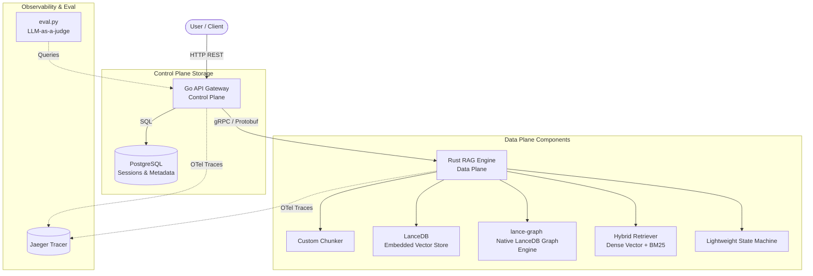

# Shrag 🚀

> [!NOTE]
> **Project Status: Planning & Pre-Start Phase**
> This repository currently contains the architectural design blueprints, brainstorming files, and the implementation plan. No source code has been written yet. Development will begin shortly following the roadmap detailed below.

**Shrag** is an end-to-end, high-performance, systems-oriented Retrieval-Augmented Generation (RAG) and GraphRAG platform. Built to showcase robust systems engineering and data-plane design, it employs a split-service architecture that separates a user-facing control plane from a high-performance, custom-built data plane.

---

## 📖 The Story & Motivation

Most modern RAG applications are built using high-level orchestration frameworks (like LangChain or LlamaIndex) and pre-packaged API wrappers. While convenient, this approach hides the underlying data-plane complexities, database access patterns, and performance characteristics. 

**Shrag** is a project designed to show high-level backend systems engineering depth by building the core data-plane components from scratch. Instead of using off-the-shelf wrappers, Shrag implements custom chunkers, indexing, query retrieval, and graph traversals in **Rust**, linking them to a lightweight **Go** control-plane gateway via **gRPC**. 

By focusing on custom-built database operations and explicit microservice boundaries, Shrag demonstrates how to optimize latency-sensitive AI workloads while maintaining production-grade type safety and observability.

---

## 🎯 Target Architecture & Core Components

Once implemented, the platform will utilize a split-service architecture:

### Key Technical Targets

1. **Go API Gateway (Control Plane):** A lightweight, concurrent HTTP REST server in Go to handle user session states, routing, authentication, and document upload schemas, backed by a relational PostgreSQL database.
2. **Rust RAG Engine (Data Plane):** A computationally optimized, memory-safe, asynchronous gRPC server implementing:
   - **Structure-Aware Recursive Chunker:** A custom parser processing heterogeneous document formats (Markdown, JSON, text) into semantic units rather than arbitrary text chunks.
   - **Hybrid vector and lexical retriever:** A query engine combining embedded **LanceDB** dense vector search with a local, in-memory **BM25 lexical index** and metadata filtering.
   - **GraphRAG Traverser:** A native knowledge graph orchestrator utilizing `lance-graph` (LanceDB's Arrow-based graph engine) to query entity-relation property graphs using Cypher.
3. **gRPC Interface:** A type-safe Protobuf boundary defined to establish communication between the Go and Rust microservices.
4. **Distributed Tracing (OpenTelemetry):** Native trace instrumentation across Go, Rust, and LLM boundaries, exporting to a local Jaeger instance to isolate latency bottlenecks.
5. **LLM-as-a-judge Evaluation:** An offline validation suite in Python to benchmark retrieval recall, precision, and faithfulness.

---

## 📂 Repository Contents

Currently, the repository contains the following planning and design documents:
* [rag_side_project_brainstorming_document.md](file:///d:/Repos/shrag/rag_side_project_brainstorming_document.md): The initial brainstorming log, evaluating system trade-offs, technology choices, and resume impact evaluation.
* [final_implementation_decision_document.md](file:///d:/Repos/shrag/final_implementation_decision_document.md): The finalized architectural, storage, and custom vs. framework engineering choices.
* [implementation_plan.md](file:///d:/Repos/shrag/implementation_plan.md): The step-by-step technical plan for bootstrapping the gRPC contracts, directories, and files.

---

## 🗺️ Implementation Roadmap

We will build the codebase across five key phases:

### Phase 1: gRPC Contract & Environment Setup
* Define the protobuf messages and service API in `proto/shrag.proto`.
* Configure `docker-compose.yml` to spin up PostgreSQL and Jaeger.
* Scaffold the Rust `engine` and Go `gateway` project workspaces.

### Phase 2: Rust Data Plane Core
* Build the custom structure-aware document parser/chunker.
* Set up LanceDB integration and the in-memory BM25 index.
* Implement the hybrid retriever logic combining dense search and BM25.

### Phase 3: GraphRAG Capabilities
* Integrate `lance-graph` within the Rust engine.
* Implement the LLM-driven entity/relationship extraction pipeline during chunk ingestion.
* Build the GraphRAG query orchestrator executing Cypher queries to build context.

### Phase 4: Control Plane & Gateway
* Implement the Go HTTP endpoints for document uploading and RAG querying.
* Hook up PostgreSQL for schema, user sessions, and document metadata.
* Connect the Go HTTP handlers to the Rust gRPC engine.

### Phase 5: Observability & Validation
* Add OpenTelemetry tracing instrumentation to Go routes and Rust retrieval/LLM endpoints.
* Implement the offline LLM-as-a-judge script (`eval.py`) to run benchmarking.
